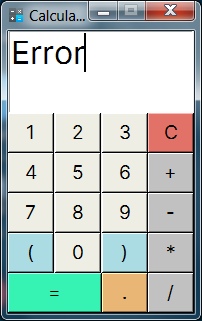
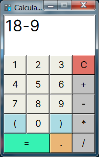
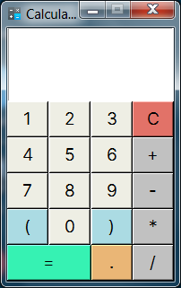

# GUI Calculator
## Description
Create your own standard **Python GUI Calculator** App using *Python 3* and *tkinter library*.

> *Tkinter is already in your python's workstation without any *pip* installation.*

## Screenshot




---

## Create Standalone Executable
Of course, with python you can convert main file (.py) to executable file (.exe), just a few script in powershell or cmd if you work on windows environment:

```shell
pip install pyinstaller
pyinstaller --onefile -w calc.py
```
